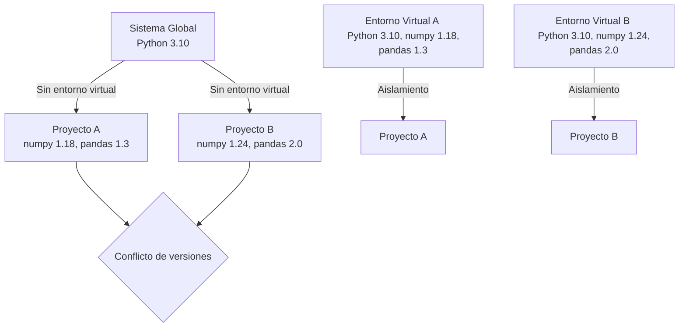
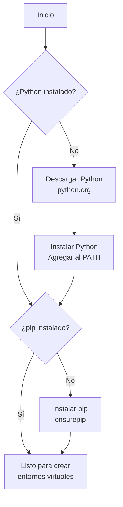
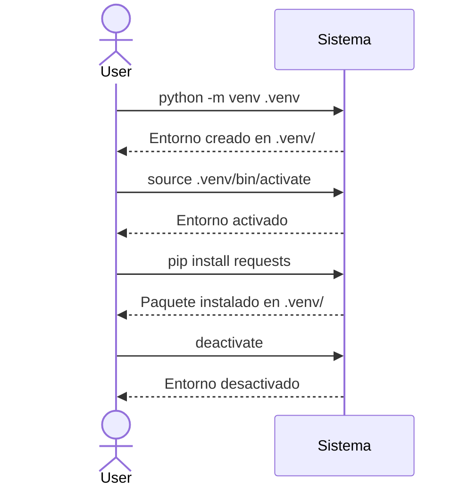
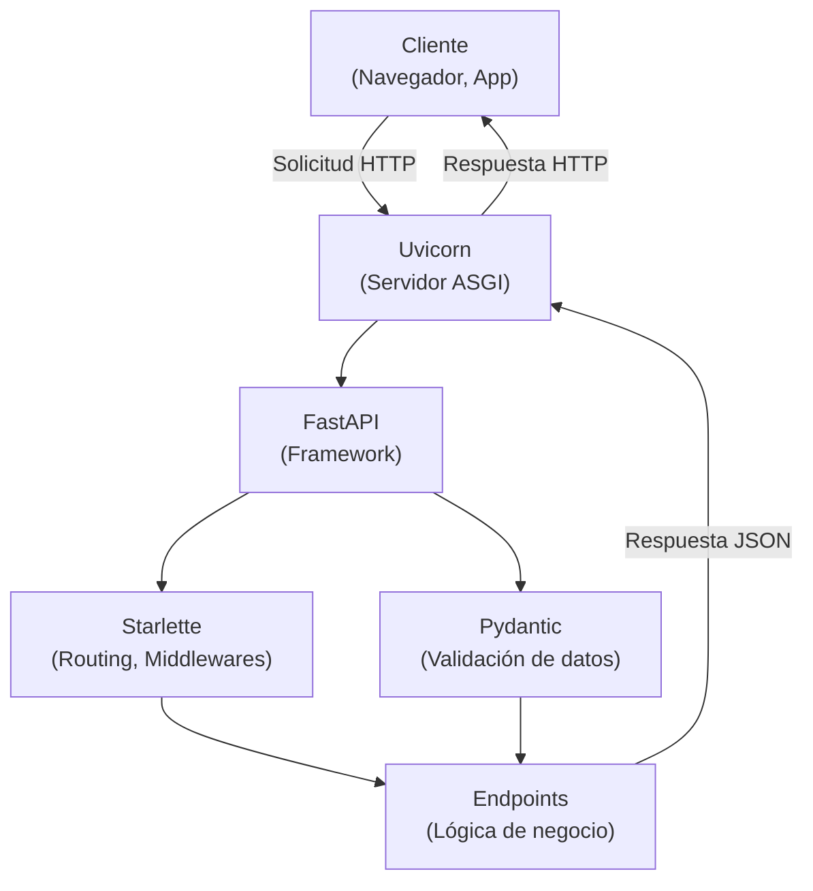
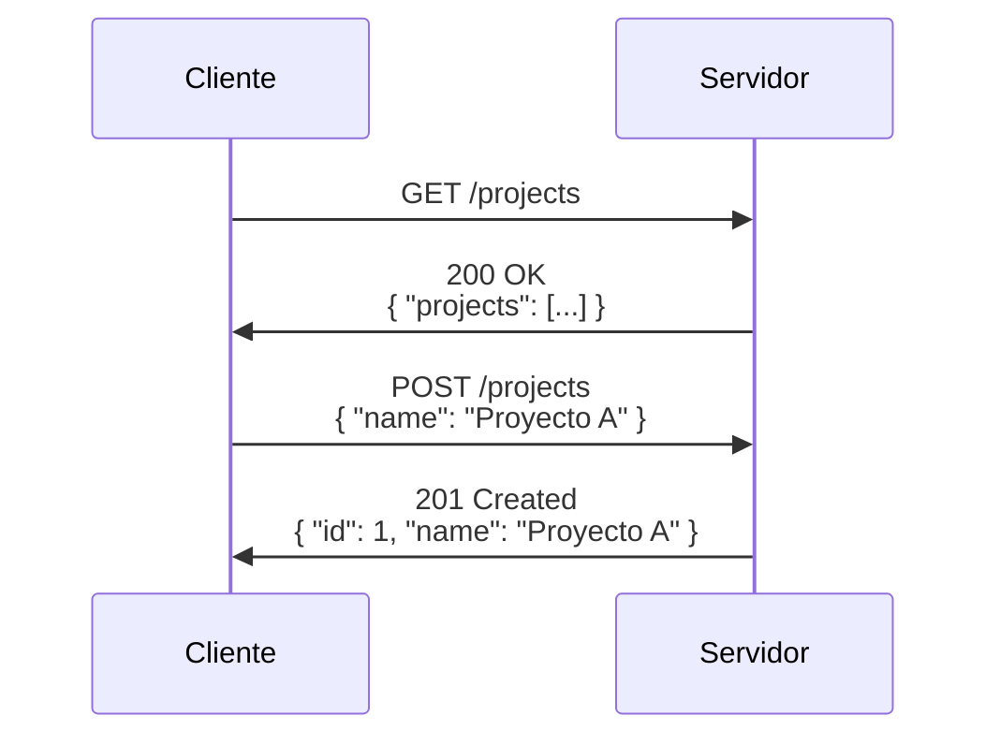
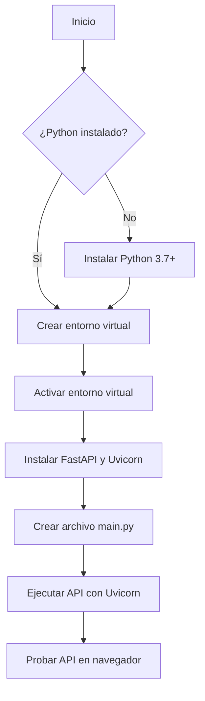

# Clase 2: Entornos Virtuales en Python e Introducción a FastAPI y APIs REST 🐍

¡Bienvenidos a este tutorial definitivo sobre **entornos virtuales en Python**! 🎉 Los entornos virtuales son una herramienta esencial para cualquier desarrollador de Python, ya que permiten aislar dependencias, gestionar proyectos y evitar conflictos entre paquetes. En este tutorial, aprenderás desde los conceptos básicos hasta técnicas avanzadas, con ejemplos prácticos, diagramas visuales y consejos útiles, todo presentado en un formato claro y atractivo. ¡Empecemos! 🚀

---

## Objetivo del Tutorial 🎯

✅ **Dominar los entornos virtuales en Python**  
Al finalizar, podrás:

- Comprender qué son los entornos virtuales y por qué son importantes.
- Crear, activar, usar y eliminar entornos virtuales con `venv` y otras herramientas.
- Gestionar dependencias y exportar requisitos.
- Resolver problemas comunes y aplicar mejores prácticas.

---

## Contenido del Tutorial 📚

### 1. ¿Qué es un Entorno Virtual? 🌐

Un **entorno virtual** en Python es un espacio aislado que contiene una copia del intérprete de Python y sus bibliotecas, permitiendo instalar paquetes específicos para un proyecto sin afectar otros proyectos o el sistema global. Imagina que cada entorno virtual es una "caja" independiente con su propio conjunto de herramientas.

#### ¿Por qué usar entornos virtuales? 🤔

- **Aislamiento**: Evita conflictos entre versiones de paquetes (ej. `numpy 1.18` vs. `numpy 1.24`).
- **Organización**: Mantiene las dependencias de cada proyecto separadas.
- **Portabilidad**: Facilita compartir proyectos con archivos de requisitos.
- **Seguridad**: Protege el sistema global de instalaciones no deseadas.

#### Flujo de trabajo con entornos virtuales

Este diagrama muestra cómo funcionan los entornos virtuales:



!!! info "Dato curioso"
    Los entornos virtuales fueron introducidos en Python 3.3 con el módulo `venv`, aunque herramientas como `virtualenv` existían antes.

---

### 2. Herramientas para Entornos Virtuales 🛠️

Python ofrece varias herramientas para crear entornos virtuales. Aquí exploramos las más comunes:

#### a) `venv` (Recomendado)

- Incluido en Python 3.3+.
- Ligero, estándar y sin dependencias externas.
- Ideal para la mayoría de los proyectos.

#### b) `virtualenv`

- Herramienta de terceros más antigua.
- Compatible con Python 2 y versiones antiguas de Python 3.
- Ofrece características adicionales (ej. soporte para múltiples intérpretes).

#### c) Otros (Breve mención)

- `Conda`: Popular en ciencia de datos, gestiona entornos y paquetes no-Python.
- `Poetry`/`Pipenv`: Combinan gestión de entornos y dependencias.

!!! tip "Consejo"
    Usa `venv` para simplicidad y compatibilidad, a menos que necesites funciones específicas de otras herramientas.

---

### 3. Configuración Inicial: Instalación de Python 📦

Antes de crear entornos virtuales, asegúrate de tener Python instalado.

#### Pasos

1. **Descarga Python**:
   - Visita [python.org](https://www.python.org/downloads/) y descarga Python 3.7+.
   - En Windows, marca "Agregar Python al PATH" durante la instalación.

2. **Verifica la instalación**:

```bash
python --version
```

**Salida esperada**:
```
Python 3.10.5
```

3. **Instala `pip`** (si no está incluido):

```bash
python -m ensurepip --upgrade
python -m pip install --upgrade pip
```

#### Diagrama de instalación



---

### 4. Crear y Gestionar Entornos Virtuales con `venv` ⚙️

El módulo `venv` es la forma estándar de crear entornos virtuales en Python. A continuación, te guiamos paso a paso.

#### Paso 1: Crear un entorno virtual

1. Navega al directorio de tu proyecto:

```bash
cd mi_proyecto
```

2. Crea un entorno virtual (llamado `venv` por convención):

```bash
python -m venv .venv
```

Esto crea una carpeta `.venv/` con:
- Un intérprete de Python aislado.
- Una copia de `pip`.
- Directorios para paquetes (`site-packages`).

#### Paso 2: Activar el entorno virtual

Activa el entorno para que los comandos `python` y `pip` usen la versión aislada:

- **Windows**:

```bash
.venv\Scripts\activate
```

- **Linux/macOS**:

```bash
source .venv/bin/activate
```

**Salida esperada** (prompt cambia):
```
(venv) user@machine:~/mi_proyecto$
```

#### Paso 3: Instalar paquetes

Con el entorno activado, instala paquetes con `pip`:

```bash
pip install requests
```

Verifica los paquetes instalados:

```bash
pip list
```

**Salida ejemplo**:
```
Package    Version
---------- -------
pip        22.3.1
requests   2.28.1
setuptools 65.5.0
```

#### Paso 4: Desactivar el entorno

Para salir del entorno virtual:

```bash
deactivate
```

El prompt vuelve a la normalidad.

#### Diagrama de gestión de entornos virtuales



!!! success "¡Logro desbloqueado!"
    Has creado y activado tu primer entorno virtual. ¡Estás listo para desarrollar proyectos aislados!

---

### 5. Gestión de Dependencias 📋

Para compartir tu proyecto, necesitas documentar las dependencias. Aquí te mostramos cómo hacerlo.

#### Exportar dependencias

Crea un archivo `requirements.txt` con las dependencias instaladas:

```bash
pip freeze > requirements.txt
```

**Contenido ejemplo**:
```
requests==2.28.1
urllib3==1.26.12
```

#### Instalar dependencias desde `requirements.txt`

En otro sistema o entorno, instala las dependencias:

```bash
pip install -r requirements.txt
```

!!! tip "Buena práctica"
    Incluye `requirements.txt` en tu repositorio Git para facilitar la colaboración.

---

### 6. Uso de Entornos Virtuales en Proyectos Reales 🖥️

Veamos un ejemplo práctico con un proyecto que usa FastAPI.

#### Estructura del proyecto

```
mi_proyecto/
├── main.py
├── requirements.txt
├── .venv/
```

#### Código de ejemplo (`main.py`)

```python
from fastapi import FastAPI

app = FastAPI()

@app.get("/")
def read_root():
    return {"message": "¡Hola, mundo!"}
```

#### Pasos

1. Crea el entorno virtual:

```bash
python -m venv .venv
```

2. Activa el entorno:

```bash
source .venv/bin/activate  # Linux/macOS
.venv\Scripts\activate     # Windows
```

3. Instala FastAPI y Uvicorn:

```bash
pip install fastapi uvicorn
```

4. Exporta las dependencias:

```bash
pip freeze > requirements.txt
```

5. Ejecuta la aplicación:

```bash
uvicorn main:app --reload
```

Visita `http://127.0.0.1:8000` para ver la respuesta.

!!! note "Práctica recomendada"
    Crea un entorno virtual por proyecto para mantener las dependencias organizadas.

---


## Introducción a FastAPI y APIs REST 🌟

¡Bienvenidos al curso de **FastAPI**! En esta primera clase, exploraremos los fundamentos de FastAPI, las APIs REST y cómo configurar tu entorno de desarrollo para crear APIs modernas y rápidas con Python. A través de explicaciones, ejemplos prácticos y diagramas visuales, estarás listo para construir tu primera API. ¡Empecemos! 🚀

---

## Objetivo de la Clase 🎯

✅ **Comprender FastAPI y configurar el entorno de desarrollo**  
Al finalizar esta clase, entenderás qué es FastAPI, sus ventajas, los conceptos clave de las APIs REST y tendrás un entorno funcional para desarrollar aplicaciones.

---

## Contenido de la Clase 📚

### 1. ¿Qué es FastAPI? Ventajas y Comparación con Otros Frameworks 🛠️

**FastAPI** es un framework web moderno para construir APIs con Python, diseñado para ser rápido, fácil de usar y compatible con estándares como **ASGI** (Asynchronous Server Gateway Interface). Creado por **Sebastián Ramírez**, FastAPI combina rendimiento, tipado y documentación automática, lo que lo hace ideal para proyectos de cualquier escala.

#### Arquitectura de FastAPI

El siguiente diagrama muestra cómo FastAPI procesa solicitudes:




#### ¿Por qué elegir FastAPI? 🌈

- **Rendimiento**: Comparable con Node.js y Go, gracias a **Starlette** y **Uvicorn**.
- **Tipado y validación**: Usa **Pydantic** para validar datos automáticamente.
- **Documentación automática**: Genera interfaces con **Swagger UI** y **ReDoc**.
- **Asincronía**: Soporta `async/await` para aplicaciones de alto rendimiento.
- **Simplicidad**: Sintaxis clara y moderna.

#### Comparación con otros frameworks 📊

| Framework   | Velocidad | Tipado | Documentación Automática | Asincronía | Curva de Aprendizaje |
|-------------|-----------|--------|--------------------------|------------|----------------------|
| **FastAPI** | ⭐⭐⭐⭐⭐ | Sí     | Sí (Swagger, ReDoc)      | Sí         | Media                |
| **Flask**   | ⭐⭐⭐      | No     | No                       | No         | Baja                 |
| **Django**  | ⭐⭐⭐      | Parcial| No                       | Parcial    | Alta                 |

!!! info "Dato curioso"
    FastAPI se inspira en Flask, pero añade soporte asíncrono y validación automática, revolucionando el desarrollo de APIs en Python.

---

### 2. Conceptos de APIs REST: Métodos HTTP, Endpoints y JSON 🌐

Una **API REST** (Representational State Transfer) es un estilo arquitectónico para diseñar aplicaciones web que permite la comunicación entre sistemas mediante HTTP. Es la base de muchas aplicaciones modernas, conectando frontends (como React) con backends.

#### Componentes clave de una API REST 📝

- **Endpoints**: URLs que representan recursos (ej. `/users`, `/projects/1`).
- **Métodos HTTP**:
  - `GET`: Obtener datos.
  - `POST`: Crear recursos.
  - `PUT`/`PATCH`: Actualizar recursos.
  - `DELETE`: Eliminar recursos.
- **JSON**: Formato para enviar y recibir datos.
- **Códigos de estado HTTP**: Ej. `200 OK`, `404 Not Found`.

#### Flujo de una solicitud REST

Este diagrama ilustra el proceso de una solicitud REST:



#### Ejemplo de solicitud REST 🖥️

```http
GET /api/projects HTTP/1.1
Host: example.com
Accept: application/json
```

**Respuesta**:

```json
{
  "projects": [
    {"id": 1, "name": "Proyecto A", "status": "active"},
    {"id": 2, "name": "Proyecto B", "status": "completed"}
  ]
}
```

!!! tip "Consejo práctico"
    Aprende los códigos de estado HTTP más comunes (200, 201, 400, 404, 500) para depurar tus APIs eficazmente.

---

### 3. Instalación de FastAPI, Uvicorn y Python ⚙️

Para desarrollar con FastAPI, necesitas un entorno configurado. A continuación, te guiamos paso a paso.

#### Proceso de configuración

Este diagrama muestra los pasos para configurar el entorno:



#### Paso 1: Instalar Python 📦

1. Descarga Python 3.7+ desde [python.org](https://www.python.org/downloads/).
2. Verifica la instalación:

```bash
python --version
```

#### Paso 2: Crear un entorno virtual 🌐

```bash
python -m venv .venv
```

Activa el entorno:

- **Windows**: `.venv\Scripts\activate`
- **Linux/macOS**: `source .venv/bin/activate`

#### Paso 3: Instalar FastAPI y Uvicorn 📲

```bash
pip install fastapi uvicorn
```

#### Paso 4: Crear tu primera API 🎉

Crea un archivo `main.py`:

```python
from fastapi import FastAPI

app = FastAPI()

@app.get("/projects")
def get_projects():
    return {"projects": [{"id": 1, "name": "Proyecto A", "status": "active"}]}
```

Ejecuta la API:

```bash
uvicorn main:app --reload
```

Visita `http://127.0.0.1:8000/projects` para ver la respuesta JSON o `http://127.0.0.1:8000/docs` para la documentación.

!!! success "¡Primer logro!"
    Has creado tu primera API con FastAPI. ¡El cielo es el límite!

---

## Práctica de la Clase 🖥️

🎯 **Tarea práctica**:  
Crea una API con un endpoint `/projects` que devuelva una lista de tres proyectos en JSON, cada uno con `id`, `name` y `status`.

**Código de ejemplo**:

```python
from fastapi import FastAPI

app = FastAPI()

@app.get("/projects")
def get_projects():
    return {
        "projects": [
            {"id": 1, "name": "Proyecto A", "status": "active"},
            {"id": 2, "name": "Proyecto B", "status": "completed"},
            {"id": 3, "name": "Proyecto C", "status": "pending"}
        ]
    }
```

**Instrucciones**:
1. Guarda el código en `main.py`.
2. Ejecuta con `uvicorn main:app --reload`.
3. Verifica en `http://127.0.0.1:8000/projects`.
4. Explora la documentación en `http://127.0.0.1:8000/docs`.

---


# Actividad: Consumir la API REST desde Postman, Thunder Client y una Página Web 🌐

**Objetivo**:  
Aprender a consumir una API REST (como el endpoint `/projects` de la Clase 1) utilizando **Postman**, **Thunder Client** (extensión de VS Code), y una página web básica con **HTML/JavaScript**, documentando el proceso y los resultados.

## Instrucciones 📝

Investiga y prueba cómo consumir la API REST creada en la Clase 1 (`http://127.0.0.1:8000/projects`) utilizando tres métodos:

1. **Postman**:

2. **Thunder Client** (extensión de VS Code):   

3. **Página web con HTML/JavaScript**:  


## Entregables 📦

- Archivo `actividad.md` con la documentación y el párrafo de hallazgos.
- Capturas de pantalla de Postman y Thunder Client.
- Archivo `index.html` con el código JavaScript.
- Repositorio GitHub con todos los archivos.

